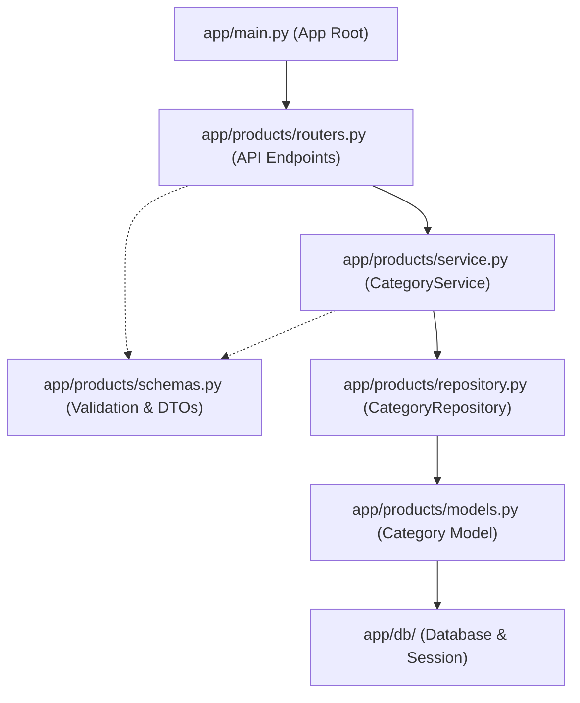

# Category Feature API Guide

## Summary
The Category feature organizes products into distinct catalog classifications. Each product links to a category via `category_id`.

Associated source files:
- Router: `app/products/routers.py`
- Service: `app/products/service.py`
- Repository: `app/products/repository.py`
- Schemas: `app/products/schemas.py`
- Model: `app/products/models.py`

---

## Schemas

### CategoryCreate
| Field | Type | Required | Rules | Description |
| :--- | :--- | :--- | :--- | :--- |
| `name` | string | Yes | 1-100 characters, unique | Name of the category |

### CategoryResponse
| Field | Type | Description |
| :--- | :--- | :--- |
| `id` | integer | Unique category ID |
| `name` | string | Category name |

---

## Endpoints

### 1. Create Category
Creates a new category record.

- **Method**: `POST`
- **Path**: `/products/create_category`
- **Status**: `201 Created`

#### Request Body
```json
{
  "name": "Electronics"
}
```

#### Response Body
```json
{
  "id": 1,
  "name": "Electronics"
}
```

#### cURL Example
```bash
curl -X POST http://localhost:8000/products/create_category \
  -H "Content-Type: application/json" \
  -d '{
    "name": "Electronics"
  }'
```

---

## Repository Capabilities

The `CategoryRepository` in `app/products/repository.py` already implements data operations ready for future endpoint additions:

- `create(db, category_data)`: Adds and returns a new category.
- `get_by_id(db, category_id)`: Fetches a category by its primary key.
- `delete(db, category)`: Removes a category entity.

---

## File Association Flow



