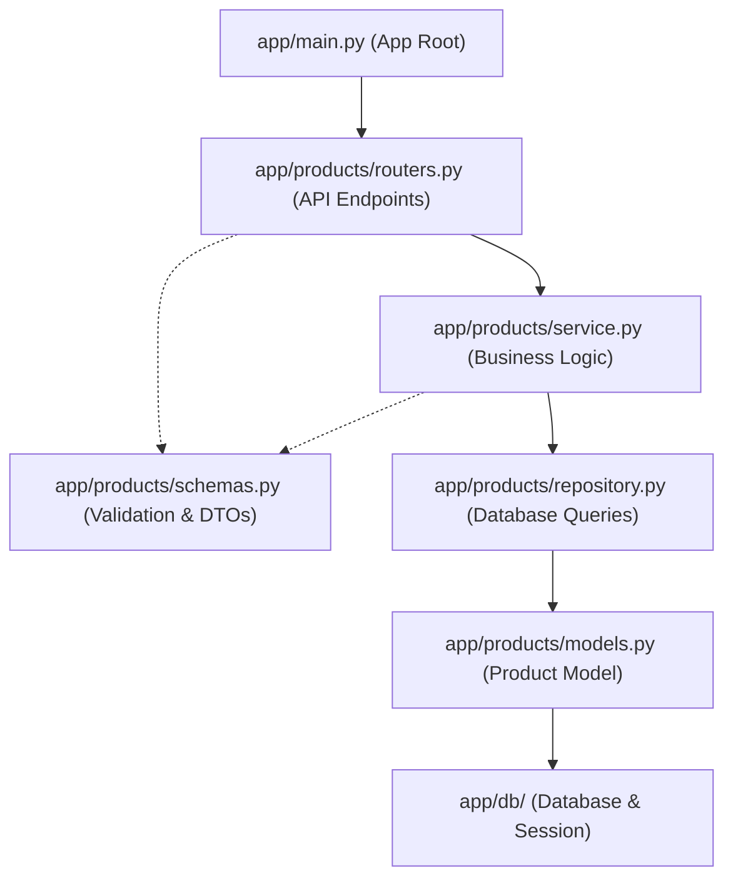

# Product Feature API Guide

## Summary
The Product feature manages catalog items: creating products, browsing and filtering with pagination, viewing details, updating product information, and removing products.

Associated source files:
- Router: `app/products/routers.py`
- Service: `app/products/service.py`
- Repository: `app/products/repository.py`
- Schemas: `app/products/schemas.py`
- Model: `app/products/models.py`

---

## Schemas

### ProductCreate
| Field | Type | Required | Rules | Description |
| :--- | :--- | :--- | :--- | :--- |
| `name` | string | Yes | 1-200 characters | Name of the product |
| `description` | string | No | null by default | Detailed description |
| `price` | number | Yes | > 0, max 2 decimals | Unit price |
| `stock` | integer | Yes | >= 0 | Quantity in inventory |
| `category_id` | integer | Yes | Valid category ID | Foreign key to Category |
| `image_url` | string | No | null by default | URL link to product image |

### ProductUpdate
All fields are optional. Only sent fields are updated.
| Field | Type | Required | Rules | Description |
| :--- | :--- | :--- | :--- | :--- |
| `name` | string | No | 1-200 characters | Updated name |
| `description` | string | No | — | Updated description |
| `price` | number | No | > 0, max 2 decimals | Updated price |
| `stock` | integer | No | >= 0 | Updated inventory count |
| `category_id` | integer | No | — | Updated category |
| `image_url` | string | No | — | Updated image URL |

### ProductResponse
| Field | Type | Description |
| :--- | :--- | :--- |
| `id` | integer | Unique product ID |
| `name` | string | Product name |
| `description` | string \| null | Description |
| `price` | number | Unit price |
| `stock` | integer | Current inventory count |
| `category_id` | integer | Associated category ID |
| `image_url` | string \| null | Image URL |
| `created_at` | datetime | Timestamp created (UTC) |
| `updated_at` | datetime | Timestamp last updated (UTC) |

---

## Endpoints

### 1. Create Product
Creates a new product record.

- **Method**: `POST`
- **Path**: `/products`
- **Status**: `201 Created`

#### Request Body
```json
{
  "name": "Wireless Mouse",
  "description": "Ergonomic 2.4GHz optical mouse",
  "price": 29.99,
  "stock": 100,
  "category_id": 1,
  "image_url": "https://example.com/mouse.jpg"
}
```

#### Response Body
```json
{
  "id": 1,
  "name": "Wireless Mouse",
  "description": "Ergonomic 2.4GHz optical mouse",
  "price": 29.99,
  "stock": 100,
  "category_id": 1,
  "image_url": "https://example.com/mouse.jpg",
  "created_at": "2026-10-04T12:00:00",
  "updated_at": "2026-10-04T12:00:00"
}
```

#### cURL Example
```bash
curl -X POST http://localhost:8000/products \
  -H "Content-Type: application/json" \
  -d '{
    "name": "Wireless Mouse",
    "description": "Ergonomic 2.4GHz optical mouse",
    "price": 29.99,
    "stock": 100,
    "category_id": 1,
    "image_url": "https://example.com/mouse.jpg"
  }'
```

---

### 2. List Products
Returns paginated products with optional search and filters.

- **Method**: `GET`
- **Path**: `/products`
- **Status**: `200 OK`

#### Query Parameters
| Parameter | Type | Default | Description |
| :--- | :--- | :--- | :--- |
| `page` | integer | `1` | Page number (`>= 1`) |
| `limit` | integer | `20` | Items per page (`1 - 100`) |
| `search` | string | `null` | Case-insensitive match on name or description |
| `category_id` | integer | `null` | Filter by category ID |
| `min_price` | number | `null` | Minimum price (`>= 0`) |
| `max_price` | number | `null` | Maximum price (`>= 0`) |

#### Response Body
```json
[
  {
    "id": 1,
    "name": "Wireless Mouse",
    "description": "Ergonomic 2.4GHz optical mouse",
    "price": 29.99,
    "stock": 100,
    "category_id": 1,
    "image_url": "https://example.com/mouse.jpg",
    "created_at": "2026-10-04T12:00:00",
    "updated_at": "2026-10-04T12:00:00"
  }
]
```

#### cURL Example
```bash
# Default list (page 1, limit 20)
curl -X GET "http://localhost:8000/products"

# Filtered search
curl -X GET "http://localhost:8000/products?page=1&limit=10&search=mouse&category_id=1&min_price=10&max_price=50"
```

---

### 3. Get Product by ID
Retrieves details for a single product.

- **Method**: `GET`
- **Path**: `/products/{product_id}`
- **Status**: `200 OK` (or `404 Not Found`)

#### Response Body
```json
{
  "id": 1,
  "name": "Wireless Mouse",
  "description": "Ergonomic 2.4GHz optical mouse",
  "price": 29.99,
  "stock": 100,
  "category_id": 1,
  "image_url": "https://example.com/mouse.jpg",
  "created_at": "2026-10-04T12:00:00",
  "updated_at": "2026-10-04T12:00:00"
}
```

#### cURL Example
```bash
curl -X GET http://localhost:8000/products/1
```

---

### 4. Update Product
Updates one or more fields of an existing product.

- **Method**: `PUT`
- **Path**: `/products/{product_id}`
- **Status**: `200 OK` (or `404 Not Found`)

#### Request Body
```json
{
  "price": 24.99,
  "stock": 85
}
```

#### Response Body
```json
{
  "id": 1,
  "name": "Wireless Mouse",
  "description": "Ergonomic 2.4GHz optical mouse",
  "price": 24.99,
  "stock": 85,
  "category_id": 1,
  "image_url": "https://example.com/mouse.jpg",
  "created_at": "2026-10-04T12:00:00",
  "updated_at": "2026-10-04T12:30:00"
}
```

#### cURL Example
```bash
curl -X PUT http://localhost:8000/products/1 \
  -H "Content-Type: application/json" \
  -d '{
    "price": 24.99,
    "stock": 85
  }'
```

---

### 5. Delete Product
Permanently deletes a product.

- **Method**: `DELETE`
- **Path**: `/products/{product_id}`
- **Status**: `204 No Content` (or `404 Not Found`)

#### Response Body
*Empty body*

#### cURL Example
```bash
curl -i -X DELETE http://localhost:8000/products/1
```

---

## File Association Flow



