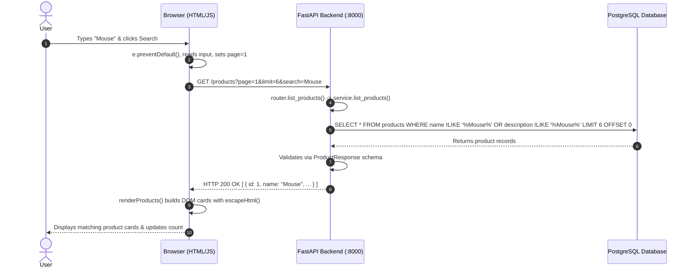

# End-to-End Project Summary & Completed Milestones

This document provides a comprehensive, end-to-end record of everything designed, built, integrated, and verified in the E-Commerce application so far.

---

## Table of Contents

1. [High-Level Architecture & Philosophy](#1-high-level-architecture--philosophy)
2. [Project Setup & Environment](#2-project-setup--environment)
3. [Database & Migrations Layer](#3-database--migrations-layer)
4. [Backend: Product Module (4-Layer Pattern)](#4-backend-product-module-4-layer-pattern)
5. [Backend: FastAPI Application & Middleware](#5-backend-fastapi-application--middleware)
6. [Frontend: UI, Design System & DOM Manipulation](#6-frontend-ui-design-system--dom-manipulation)
7. [Frontend: JavaScript Client Logic & State](#7-frontend-javascript-client-logic--state)
8. [End-to-End Integration Flow](#8-end-to-end-integration-flow)
9. [Documentation & API Reference Completed](#9-documentation--api-reference-completed)
10. [Current Project Structure](#10-current-project-structure)
11. [What Comes Next (Phase 2 Roadmap)](#11-what-comes-next-phase-2-roadmap)

---

## 1. High-Level Architecture & Philosophy

The project follows a **Modular Monolith** architecture:
* **One Deployable Application**: Avoids the premature overhead of microservices, service meshes, and distributed tracing.
* **Domain-Driven Feature Modules**: The backend is organized by discrete domain features (`products`, and upcoming `users`, `auth`, `cart`, `orders`).
* **Backend-First Incremental Approach**:
  1. Define database schema & migrations.
  2. Implement repository, business logic service, and API routers.
  3. Validate endpoints with Swagger docs and cURL.
  4. Build pure HTML/CSS/JS frontend to consume the API.
  5. Connect and verify the full round-trip flow from browser to database.

```
                    E-Commerce Application
                             │
              ┌──────────────┴──────────────┐
              │                             │
           Frontend                       Backend
       (HTML / CSS / JS)                  (FastAPI)
              │                             │
              │                  ┌──────────┼──────────┐
              │                  │          │          │
              │              Products     Users      Orders
              │                  │          │          │
              │                  └──────────┼──────────┘
              │                             │
              │                        PostgreSQL
              │                             │
              └──────────── HTTP / API ─────┘
```

---

## 2. Project Setup & Environment

* **Python Runtime**: Python `>= 3.12`.
* **Package Management**: Managed with `pyproject.toml` and modern dependency locking via `uv`.
* **Dependencies**:
  * `fastapi`: Modern, high-performance web framework.
  * `uvicorn`: ASGI server for running the FastAPI application.
  * `sqlalchemy`: Next-gen ORM with 2.0 typed mappings.
  * `alembic`: Database migrations tool.
  * `pydantic-settings`: Type-safe configuration management from `.env`.
  * `psycopg2-binary`: PostgreSQL database adapter.
* **Configuration Layer (`app/core/config.py`)**:
  * Loads `DATABASE_URL` safely using Pydantic's `BaseSettings`.
  * Supports `.env` and fallback `.env.example`.

---

## 3. Database & Migrations Layer

### Database Setup (`app/db/`)
* **`app/db/base.py`**: Declarative base class (`Base = DeclarativeBase`) for all SQLAlchemy models.
* **`app/db/sessions.py`**:
  * Creates the SQLAlchemy engine with `settings.DATABASE_URL` (with `echo=True` for query inspection).
  * Defines `SessionLocal` factory (`autocommit=False, autoflush=False`).
  * Implements `get_db()` dependency injection generator ensuring sessions are always closed after request completion (`try ... finally: db.close()`).

### Relational Schema (`app/products/models.py`)
Utilizes SQLAlchemy 2.0 type annotations (`Mapped`, `mapped_column`, `relationship`):

1. **`categories` Table**:
   * `id`: Integer, primary key, indexed.
   * `name`: String(100), unique, non-nullable.
   * Relationship: Bidirectional 1-to-many relationship with `Product`.

2. **`products` Table**:
   * `id`: Integer, primary key, indexed.
   * `name`: String(200), non-nullable, indexed for search.
   * `description`: Text, nullable.
   * `price`: Numeric(10, 2), non-nullable.
   * `stock`: Integer, non-nullable, default `0`.
   * `category_id`: Foreign key referencing `categories.id`, non-nullable.
   * `image_url`: String(500), nullable.
   * `created_at`: DateTime UTC timestamp, non-nullable.
   * `updated_at`: DateTime UTC timestamp, auto-updated on change.
   * Relationship: Foreign key link back to `Category`.

### Alembic Migrations (`backend/alembic/`)
* Configured `env.py` to bind to `settings.DATABASE_URL` and register `Base.metadata`.
* Created and executed initial migration:
  * `f165da70bd0c_create_products_and_categories.py`: Provisions `categories` and `products` tables with foreign keys and indexes.

---

## 4. Backend: Product Module (4-Layer Pattern)

The `products` module adheres strictly to clean code separation of concerns:

```
Request ──▶ Router ──▶ Service ──▶ Repository ──▶ Database
               │           │             │
               ▼           ▼             ▼
            Schemas     Schemas        Models
```

### Layer 1: Pydantic Validation & Serialization Schemas (`app/products/schemas.py`)
* **Category**:
  * `CategoryCreate`: Validates category name (1-100 characters).
  * `CategoryResponse`: Serializes category entity including `id`.
* **Product**:
  * `ProductCreate`: Validates required fields (`name`, `price > 0`, `stock >= 0`, `category_id`).
  * `ProductUpdate`: Allows partial updates (all fields optional with validation constraints).
  * `ProductResponse`: Complete product payload with formatted price, timestamps, and ORM conversion (`from_attributes = True`).

### Layer 2: Repository Data Access (`app/products/repository.py`)
Encapsulates all direct database SQL queries using SQLAlchemy 2.0 `select()` statements:
* **`ProductRepository`**:
  * `create(db, product_data)`: Adds and commits a new product.
  * `get_by_id(db, product_id)`: Retrieves single product by primary key.
  * `get_all(db, skip, limit)`: Paginated fetch.
  * `delete(db, product)`: Deletes product entity from the session.
* **`CategoryRepository`**:
  * `create(db, category_data)`: Creates category.
  * `get_by_id(db, category_id)`: Fetches category.
  * `delete(db, category)`: Deletes category.

### Layer 3: Service Business Logic (`app/products/service.py`)
Orchestrates business workflows, input filtering, and HTTP exception handling:
* **`ProductService`**:
  * `create_product`: Validates foreign key presence and delegates creation.
  * `get_product`: Retrieves product or raises `HTTPException(404, "Product not found")`.
  * `list_products`: Dynamic query building:
    * Supports case-insensitive `ILIKE` search across both product `name` and `description`.
    * Filters by `category_id`.
    * Filters by price range (`min_price`, `max_price`).
    * Handles pagination offsets: `offset = (page - 1) * limit`.
  * `update_product`: Executes partial updates via `model_dump(exclude_unset=True)` and refreshes entity.
  * `delete_product`: Verifies existence and removes product.
* **`CategoryService`**:
  * `create_category`: Manages category creation.

### Layer 4: API Router Endpoints (`app/products/routers.py`)
Exposes RESTful endpoints under `/products`:

| Method | Endpoint | Status | Description |
| :--- | :--- | :--- | :--- |
| `POST` | `/products` | `201 Created` | Create a new product |
| `GET` | `/products` | `200 OK` | List products with pagination, search & filters |
| `GET` | `/products/{id}` | `200 OK` | Fetch product details by ID |
| `PUT` | `/products/{id}` | `200 OK` | Update product details |
| `DELETE` | `/products/{id}` | `204 No Content` | Delete a product |
| `POST` | `/products/create_category` | `201 Created` | Create a new category |

---

## 5. Backend: FastAPI Application & Middleware

In `app/main.py`:
* Initialized FastAPI application with metadata:
  ```python
  app = FastAPI(title="E-Commerce API", version="0.1.0")
  ```
* **CORS Middleware**: Configured `CORSMiddleware` to allow cross-origin requests from the frontend:
  * Allowed origins: `http://localhost:5500`, `http://127.0.0.1:5500`, and `3000`.
  * Allowed methods: `*` (GET, POST, PUT, DELETE, etc.).
  * Allowed headers: `*`.
* **Health Check**: `GET /health` returning `{"status": "ok"}`.
* **Router Inclusion**: Attached `product_router` with prefix `/products`.

---

## 6. Frontend: UI, Design System & DOM Manipulation

Built using pure **HTML5** and **Vanilla CSS** without framework overhead:

### Semantic HTML Layout (`frontend/index.html`)
1. **Navigation Bar (`.navbar`)**:
   * Brand title and icon.
   * Navigation links (`Products`, `Admin`).
   * User badge, **Cart Button** with badge counter (`Cart (0)`), and **Login Button**.
2. **Hero Banner (`.hero-banner`)**:
   * Catchy headline and description.
   * Anchor button `<a href="#products-section" class="btn btn-primary shop-now-btn">Shop Now</a>` linking smoothly down to the product catalog.
3. **Main Layout (`.layout-wrapper`)**:
   * **Sidebar (`.sidebar`)**:
     * Search form (`#searchForm`) with text input and submit button.
     * Category radio buttons (`All Products`, `Electronics`, `Clothing`).
     * "Clear Filters" button (`#clearFiltersBtn`).
   * **Products Grid (`#productsGrid`)**:
     * Responsive CSS grid where product cards are dynamically injected by JavaScript.
     * Product count indicator (`#productCount`).
   * **Pagination Section (`.pagination`)**:
     * Previous button (`#prevBtn`), Page indicator (`#pageIndicator`), and Next button (`#nextBtn`).
4. **Footer (`.footer`)**:
   * Site links and copyright notice.

### CSS Styling & Design Tokens (`frontend/css/style.css`)
* **Custom Properties / Design Tokens**: Modern color palette (`--primary: #2563eb`, `--success: #16a34a`, neutral grays, shadows, border radii).
* **Grid & Flexbox**: Auto-fit product grid (`grid-template-columns: repeat(auto-fill, minmax(260px, 1fr))`).
* **Smooth Scrolling**: Global `scroll-behavior: smooth;` for in-page navigation.
* **Component Styling**:
  * Product cards with image thumbnails, price formatting, stock status pills (`In Stock` / `Out of Stock`).
  * Interactive button states (hover effects, active transforms, disabled styling).

---

## 7. Frontend: JavaScript Client Logic & State

Located in `frontend/js/app.js`:

### 1. State Management
```javascript
const API_BASE_URL = "http://localhost:8000";
const PAGE_LIMIT = 6;

let currentPage = 1;
let selectedCategory = "";
let searchQuery = "";
let cartCount = 0;
```

### 2. Core Functions
* **`fetchProducts()`**:
  * Renders a loading state placeholder in `#productsGrid`.
  * Constructs query parameters dynamically using `URLSearchParams` (`page`, `limit`, `category_id`, `search`).
  * Calls backend API: `GET http://localhost:8000/products?...`
  * Passes JSON payload to `renderProducts()`.
  * Updates pagination state.
  * Handles connection errors gracefully with user-friendly retry guidance.
* **`renderProducts(products)`**:
  * Empties the grid container.
  * Handles empty search results (`"🔍 No products found matching your criteria"`).
  * Generates product card elements dynamically.
  * Employs `escapeHtml()` utility to prevent Cross-Site Scripting (XSS).
  * Safely handles image load errors with fallback icons.
  * Attaches event listeners to each card's "Add to Cart" button.
* **`handleAddToCart(product, button)`**:
  * Increments cart count and updates header badge (`Cart (N)`).
  * Provides visual button confirmation (`✓ Added!` with green highlight) using a temporary `setTimeout`.
* **`updatePagination(itemsReceived)`**:
  * Updates `Page X` indicator.
  * Disables "Previous" on page 1.
  * Disables "Next" when fewer items than `PAGE_LIMIT` are returned.

### 3. User Interactions & Event Handlers
* **Search Form Submission**: Prevents reload via `e.preventDefault()`, captures trimmed query, resets page to 1, and fetches filtered products.
* **Category Radio Selection**: Updates `selectedCategory`, resets page to 1, and refetches catalog.
* **Clear Filters Button**: Clears search text, checks "All Products" radio, resets internal state, and reloads full catalog.
* **Pagination (Next/Prev)**: Increments/decrements page counter and triggers `fetchProducts()`.
* **Cart Button**: Alerts user with current cart count.
* **Initial Page Load**: Triggers `fetchProducts()` upon `DOMContentLoaded`.
* **Cache Management**: Added script versioning (`<script src="js/app.js?v=2"></script>`) to prevent stale browser caching during development.

---

## 8. End-to-End Integration Flow

Here is how data flows through the entire system during a typical user action:



---

## 9. Documentation & API Reference Completed

In `backend/guide/`:
* **`product_structure/architecture.md`**: Master blueprint detailing Phase 1 (Product Store) through Phase 2 (Real E-Commerce), development rules, and technology roadmaps.
* **`api_guide/products.md`**: Complete REST API specification for products, covering schemas, rules, endpoints, status codes, and sample cURL requests.
* **`api_guide/category.md`**: Complete category API specification, schemas, repository methods, and Mermaid sequence flows.

---

## 10. Current Project Structure

```
ecommerce/
├── .env.example                               # Sample environment variables
├── .gitignore                                 # Git ignore rules
├── README.md                                  # Repository overview
│
├── backend/
│   ├── pyproject.toml                         # Project metadata & dependencies
│   ├── uv.lock                                # Pinned dependency lockfile
│   ├── alembic.ini                            # Alembic configuration
│   │
│   ├── alembic/
│   │   ├── env.py                             # Alembic runtime environment
│   │   └── versions/
│   │       └── f165da70bd0c_create_products_and_categories.py
│   │
│   ├── app/
│   │   ├── main.py                            # FastAPI app root & CORS
│   │   ├── core/
│   │   │   └── config.py                      # Pydantic BaseSettings
│   │   ├── db/
│   │   │   ├── base.py                        # Declarative Base
│   │   │   └── sessions.py                    # Engine & get_db dependency
│   │   └── products/
│   │       ├── models.py                      # SQLAlchemy Product & Category models
│   │       ├── schemas.py                     # Pydantic validation schemas
│   │       ├── repository.py                  # Database queries
│   │       ├── service.py                     # Business logic & filtering
│   │       └── routers.py                     # REST endpoints
│   │
│   └── guide/
│       ├── api_guide/
│       │   ├── products.md                    # Products API documentation
│       │   └── category.md                    # Categories API documentation
│       └── product_structure/
│           ├── architecture.md                # System architecture blueprint
│           └── complete.md                    # This document
│
└── frontend/
    ├── index.html                             # Semantic HTML5 store page
    ├── css/
    │   └── style.css                          # Modern design system & layout
    └── js/
        └── app.js                             # API integration & DOM manipulation
```

---

## 11. What Comes Next (Phase 2 Roadmap)

With Phase 1 (Product Catalog, Search, Filtering, Pagination, and Frontend Integration) complete, the project is primed for **Phase 2: Real E-Commerce**:

1. **User Management & Authentication**:
   * User model (`users` table with password hash, role).
   * JWT-based authentication (`/auth/register`, `/auth/login`, `/auth/me`).
   * Password hashing with `bcrypt` / `passlib`.
2. **Shopping Cart Persistence**:
   * Moving from frontend-only counter to persistent cart database tables (`carts`, `cart_items`).
   * Cart endpoints: add item, update quantity, remove item, clear cart.
3. **Orders & Checkout**:
   * Order processing (`orders`, `order_items` tables).
   * Status lifecycle: `pending` $\rightarrow$ `confirmed` $\rightarrow$ `shipped` $\rightarrow$ `delivered`.
   * Order history page for customers.
4. **Admin Dashboard**:
   * Dedicated product creation/editing forms in the frontend.
   * Product deletion and inventory updates.
